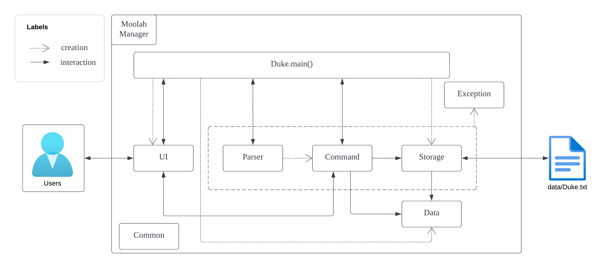
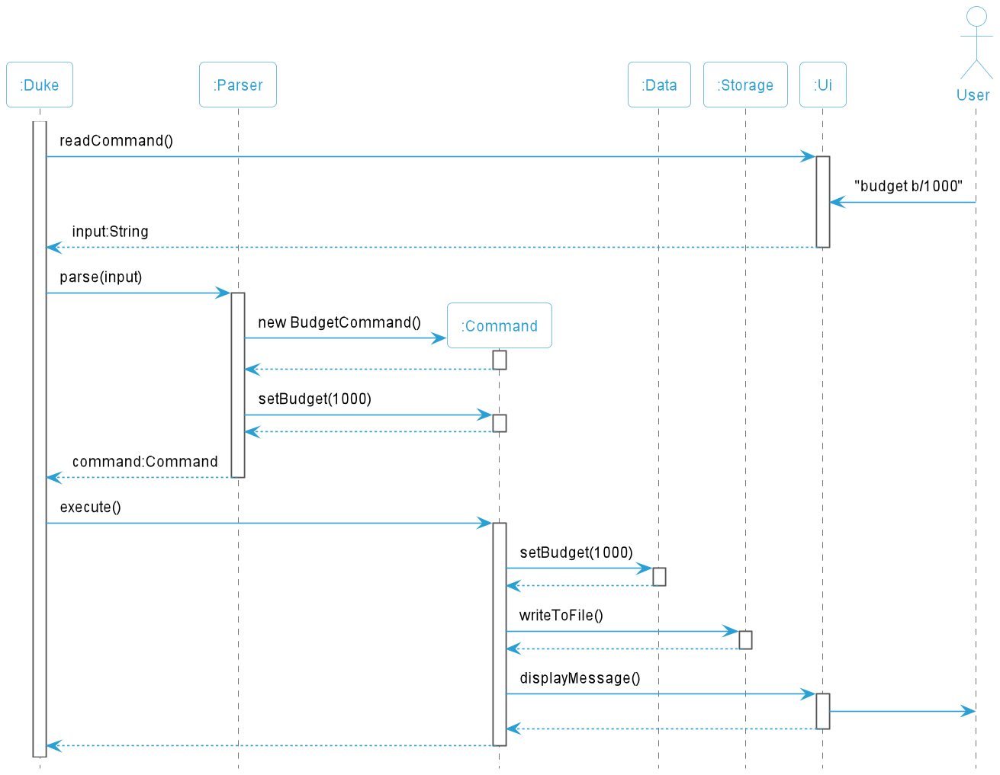
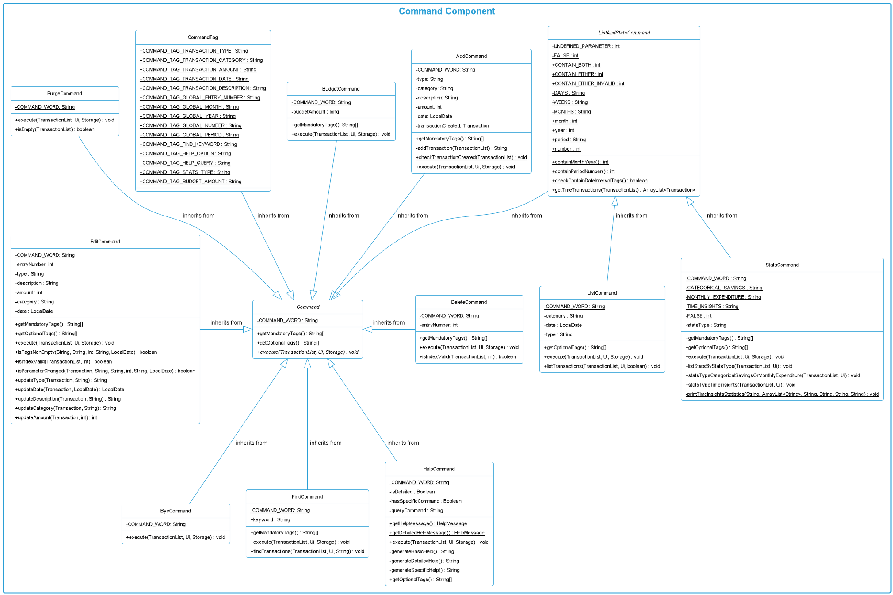
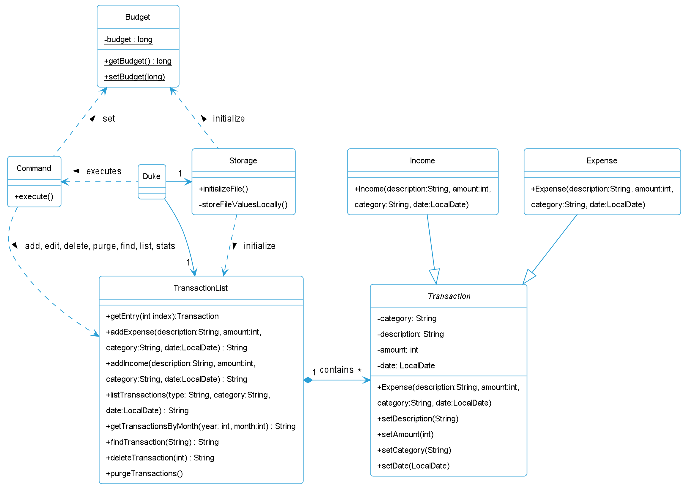
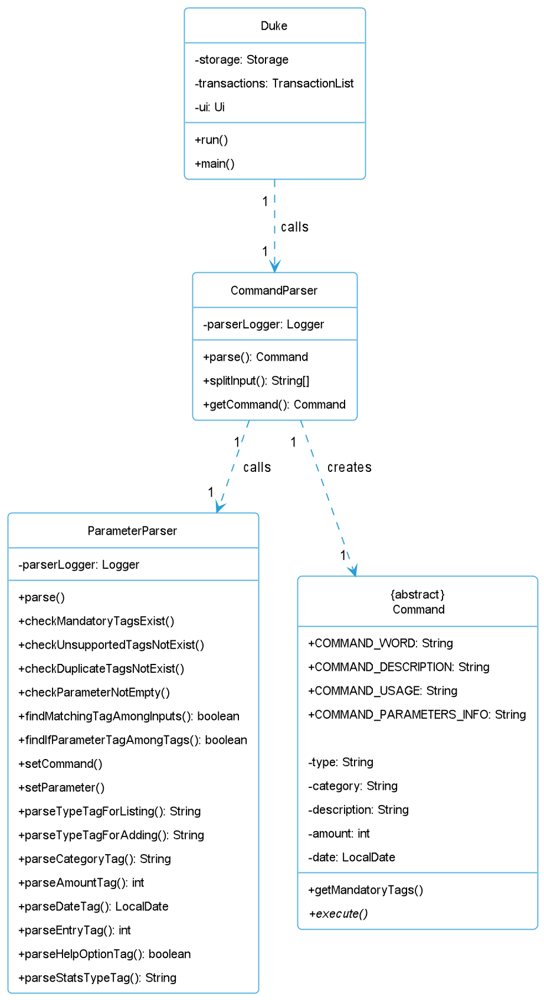
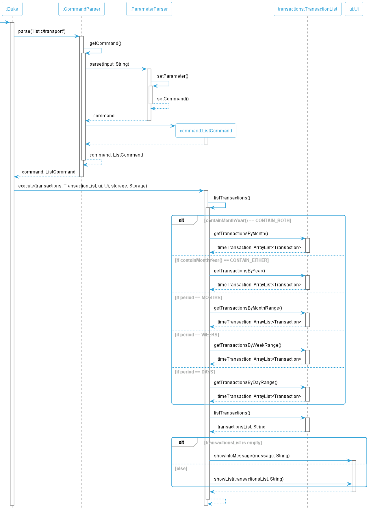

# Developer Guide

- [Preface](#preface)
- [Acknowledgements](#acknowledgements)
- [Setting Up the Project](#setting-up-the-project)
- [Design](#design)
    * [Architecture](#architecture)
    * [Command Component](#command-component)
    * [Data Component](#data-component)
    * [Storage Component](#storage-component)
    * [Parser Component](#parser-component)
    * [UI Component](#ui-component)
    * [Common Component](#common-component)
- [Implementation](#implementation)
    * [Overview for Transaction](#overview-for-transaction)
    * [Implementation for Transaction](#implementation-for-transaction)
    * [Help Command](#help-command)
    * [Budget Command](#budget-command)
    * [Add Command](#add-command)
    * [Edit Command](#edit-command)
    * [List Command](#list-command)
    * [Find Command](#find-command)
    * [Stats Command](#stats-command)
    * [Delete Command](#delete-command)
    * [Purge Command](#purge-command)
    * [Storage Operations](#storage-operations)
        + [Reading From a File](#reading-from-a-file)
        + [Writing To a File](#writing-to-a-file)
    * [Logging Operations](#logging-operations)
- [Appendix A: Product scope](#appendix-a--product-scope)
    * [Target user profile](#target-user-profile)
    * [Value proposition](#value-proposition)
- [Appendix B: User Stories](#appendix-b--user-stories)
- [Appendix C: Non-Functional Requirements](#appendix-c--non-functional-requirements)
- [Appendix D: Glossary](#appendix-d--glossary)
- [Appendix E:  Instructions for manual testing](#appendix-e---instructions-for-manual-testing)

## Preface

Moolah Manager is a desktop app for managing one's finances, optimised for use via a Command Line Interface (CLI). Designed for IT professionals who are
fast typists, it can help to process day-to-day monetary transactions that are classified into income and expense. Users can expect to get an overview of their transactions
at a glance and be provided with valuable insights into their spending habits. They are also encouraged to set budget goals to minimise their spending.

This document is meant assist developers in understanding how our program works.

_Written by: Brian Wong Yun Long_

## Acknowledgements

The format of this development guide was adapted from [SE-EDU AddressBook Level 3 Developer Guide](https://se-education.org/addressbook-level3/DeveloperGuide.html).

Some parts of the source code in this program were reused and adapted from the team's individual projects during the CS2113 IP phase.

_Written by: Brian Wong Yun Long_

## Setting Up the Project

{Detail how to set up the project on one's computer, assuming the software is Intellij IDEA}
Before setting up the project on your computer, kindly check that you have installed:

* Java JDK 11
* Intellij IDEA - highly recommended

Firstly, you should fork this repo, before cloning the fork to your computer.

Next,

1. **Ensure that Intellij JDK 11 is defined as an SDK**, as described in this [[Set up JDK guide]](https://www.jetbrains.com/help/idea/sdk.html#set-up-jdk) -- this step is not needed if you have used JDK 11 in a previous Intellij project.
    * You _might need to set the Project language level_ section to the SDK default option.
2. **Import the project _as a Gradle project_**, as described in
[[se-edu's Import Gradle Project guide]](https://se-education.org/guides/tutorials/intellijImportGradleProject.html).
3. **Running the project**: After finishing the import, locate the `src/main/java/seedu.duke/Duke.java` 
file in this project, right-click it, and choose `Run Duke.main()`.

_Written by: Paul Low_

## Design

### Architecture

The Architecture Diagram shown above explains the high-level design of Moolah Manager. 
The `Duke` class contain the main method which holds the responsibility for the following:
1. On application launch, it will initialise the `UI`, `Storage` and `Data` components. 
2. During application execution, it will interact with `UI`, `Parser`, `Command` components 
to execute the command entered by the users.
3. On any exception caught, it will handle the exception and interact with the `UI` to display the error message.

`Common` represents a collection of classes or enums used by multiple components.

The rest of the application consists of six components:
 - `UI`: The user interface of Moolah Manager
 - `Parser`: Parser for user's entered command.
 - `Command`: The command executor.
 - `Data`: Holds the data of the application in memory.
 - `Storage`: File I/O to store the data onto the hard disk.

#### How the architecture components interact with each other
The sequence diagram below shows how the components interact on command `budget b/1000`.

The section below gives more detailed description of each component.

_Written by: Chia Thin Hong_

### Command Component

The command component is represented by a `command` package which consists of all the classes that is part of the data stored
by Moolah Manager. Within the `command` package, there are many classes, each corresponding to all of our commands which are
supported by the application.

The `AddCommand` class contains the operations pertaining to adding a transaction into the list of transactions.

The `BudgetCommand` class contains the operations pertaining to setting the budget for the user.

The `ByeCommand` class contains the operations pertaining to exiting the program.

The `CommandTag` class consists of all the tags that the program parses.

The `DeleteCommand` class contains the operations pertaining to deleting a transaction from the list of transactions.

The `EditCommand` class contains the operations pertaining to editing a transaction from the list of transactions.

The `FindCommand` class contains the operations pertaining to searching the list of transactions for transactions that match the inputted keywords.

The `HelpCommand` class contains the operations pertaining to displaying help messages for the user.

The `ListCommand` class contains the operations pertaining to listing all transactions.

The `PurgeCommand` class contains the operations pertaining to deleting all transaction from the list of transactions.

The `StatsCommand` class contains the operations pertaining to getting statistics based on your list of transactions.

The structure of the command component in Moolah Manager is illustrated in the class diagram below:


_Written by: Brian Wong Yun Long_

### Data Component 

The data component is represented by a `data` package which consists of all the classes that is part of the data stored 
by Moolah Manager. Within the `data` package, a transaction package, a budget class and a transactionList class is 
stored. 

The `budget` class is a representation of the monthly budget of the users. Operations related to viewing the budget and 
differences from budget is implemented within this class.

The `transactionList` class is a representation of a list of transactions, and the
operations related to the `transactionList` implemented within this class.

Within the transaction package, the following classes are stored: 
1. Transaction 
2. Income 
3. Expense

The structure of the data component in Moolah Manager is illustrated in the class diagram below:


From the class diagram, it can be seen that the transactionList contain the methods for CRUD operations to the list, 
such as getting, adding, editing, deleting and purging of transaction(s) in the list.

The `Transaction` class is the abstract classes of an `Income` or an `Expense`. A more detailed explanation on the 
implementation on the transactions can be viewed under Section
[Implementation for Transaction](#implementation-for-transaction).

#### How the data component interacts

- When MoolahManager starts running, the `Duke` class will initialize a `Storage` object which will attempt to 
read from the file and initialize both `budget` and `transactionList`. The temporary `transactionList` containing all the stored 
transaction records will be returned by the `Storage`. 
Based on the whether the initialization is successful, the corresponding constructor will be called to initialize a 
`transactionList` object which will be used throughout the application running time to hold the `transactions` added.

  

- A transaction (either an income or expense) is created by an `addCommand` class, can be modified by an `editCommand` 
class and can be deleted by a `deleteCommand` or `purgeCommand` class. These interactions are described in further detail
under each command section below.

- The monthly budget can be updated by `budget` command.

<!-- TODO: Describe how category and categoryList work here -->

_Written by: Chia Thin Hong_

### Storage Component
The `Storage` component is a standalone class. It utilises its sub-methods and methods from external classes to perform it's read and write functions.

The structure of `Storage` can be seen below.
<p align="center">
    
    <br />
    <i> Simplified Class Diagram for Storage Component</i>
</p>

1. `Duke` initializes `Storage` and `Storage#initializeFile` is called.
2. During the initialization , parser methods from `CommandParser` and `ParameterParser` would be used to process the entries within `Duke.txt`.
Methods from `Budget` and `TransactionList` would be used for the storage of `Budget` amount and `TransactionList` entries into the program.
3. `TransactionList` is returned to `Duke` after the storage of entries within `Duke.txt`.
4. After initialization and upon user input, `Command` classes such as `AddCommand`can call for `Storage#writeToFile` method in order to update the contents within `Duke.txt`.

_Written by: Yong Chin Han_

### Parser Component
The Parser component comprises of two main parsers: `CommandParser` and `ParameterParser`. Together, both these 
parsers are used to generate a command object with its accurate parameters according to the input from the UI. 

The structure of the data component in Moolah Manager is illustrated in the class diagram below:


After `run()` is called by `main()` in Duke, the `CommandParser` is first called to parse the command. The initial
 input is split into the commandWord and parameters using `splitInput()`. Next, the command word is parsed using 
 `getCommand()`. With the new command created, the parameters are then parsed by calling `ParameterParser.parse()`
 
In `ParameterParser`, multiple checks are done to ensure that the userInput is accurate. For example, checks are done 
to confirm that all mandatory tags are filled, that no unsupported tags are used, no duplicate tags, no tags are
without parameters and finally that the formats of parameters are accurate. After all the checks are done`setCommand` 
is called to customize the command accordingly.

With the checked and accurate commands and parameters, the command is then executed by `Duke`

_Written by: Paul Low_

### UI Component

The UI component consists of a `Ui` class that displays information and error messages based on the user 
input and the behavior of the application. Static messages are pre-defined in the `ErrorMessages` and `InfoMessages` 
classes from the Common component, while  dynamic messages such as a transactions list may be generated during 
execution of the application.

<p align="center">
    
    <br />
    <i>Figure 2.6: Class Diagram for UI Component</i>
</p>

As seen from the class diagram, every command that requires the ability to print to the system output will have
to call the functions from the `Ui` class. To add on, the `Duke` class will also use the `Ui` class to read user 
input.

_Written by: Chua Han Yong Darren_

### Common Component

_Written by: Author name_

## Implementation

### Overview for Transaction

The following commands are accepted in Moolah Manager:
1) `Add` - Adds an `Income` or `expense` type transaction into the list of transaction. [Add Command](#add-command)
2) `Budget` - Adds an `Budget` into Moolah Manager, which sets the basis for financial tracking. [Budget Command](#budget-command)
3) `Bye` - Exits Moolah Manager. [Bye Command](#bye-command)
4) `Delete` - Deletes an `Income` or `expense` type transaction from the list of transaction. [Delete Command](#delete-command)
5) `Edit` - Edits an `Income` or `expense` type transaction from the list of transaction. [Edit Command](#edit-command)
6) `Find` - Searches for an `Income` or `expense` type transaction from the list of transaction given keywords. [Find Command](#find-command)
7) `Help` - Outputs the usage of commands of Moolah Manager. [Help Command](#help-command)
8) `List` - List all transactions. [List Command](#list-command)
9) `Purge` - Deletes all transactions from the list of transaction. [Purge Command](#purge-command)
10) `Stats` - View statistics on transactions based on the list of transactions in Moolah Manager. [Stats Command](#stats-command)

_Written by: Brian Wong Yun Long_

### Implementation for Transaction

Each `Transaction` object in Moolah Manager represents a transaction record, which can be of `Income`
or `Expense` type. Below is a simplified class diagram (with methods omitted) containing the attributes
within each transaction and how each transaction is associated with the `TransactionList`.

<p align="center">
    
    <br />
    <i>Figure 1: Simplified Class Diagram for Transaction</i>
</p>

The `TransactionList` holds a dynamic array list that can store multiple `Transaction` objects.

Each Transaction object contains the following mandatory member attributes:

1. **category** A category for the transaction.
2. **description** More information regarding the transaction, written without any space.
3. **amount** Value of the transaction in numerical form. Only integers within 0 and 10000000 is accepted.
4. **date** Date of the transaction. The format must be in "yyyyMMdd".

Some important operations are performed within the `TransactionList` class, which implements the following:

- `TransactionList#addIncome(String description, int amount, String category, LocalDate date)` - Adds a transaction of
  class type Income into the transactions list.
- `TransactionList#addExpense(String description, int amount, String category, LocalDate date)` - Adds a transaction of
  class type Expense into the transactions list.
- `TransactionList#listTransactions(String type, String category, LocalDate date)` - List all or some transactions based
  on selection.
- `TransactionList#findTransactions(String keywords)` - Find specific transaction(s) based on any keywords inputted by
  the user.
- `TransactionList#deleteTransaction(int index)` - Deletes a transaction from the transactions list based on the
  specified index.
- `TransactionList#purgeTransactions()` - Purges all transactions in the transactions list.

_Written by: Chua Han Yong Darren_

### Help Command
The help command displays the help message to the users to guide them on the usage and provide descriptions for each
available command.

The help command can be run as `help` or `help o/detailed`, where the latter will display a more detailed version of
help messages to the users.

The structure of the application focusing on the help command is illustrated in the class diagram below:


For each command subclass, they will implement the getHelpMessage() and getDetailedHelpMessage() methods. These methods
will contain their corresponding HelpMessage Enum that stores the help messages as strings inside the enum.

In the help command, during the execute() call, it will call either generateBasicHelp() or generateDetailedHelp() method
based on the help option chosen by the user.


_Written by: Chia Thin Hong_

### Budget Command

The budget command allows user to set a new monthly budget. The range of accepted budget value is stored in the 
`common/Constants.java` file, whereby the content of the file is as such:

```
public static int MAX_TRANSACTIONS_COUNT = 1000000;
public static int MIN_AMOUNT_VALUE = 0;
public static int MAX_AMOUNT_VALUE = 10000000;
public static int MIN_BUDGET_VALUE = 1;
public static long MAX_BUDGET_VALUE = Long.valueOf(MAX_TRANSACTIONS_COUNT) * Long.valueOf(MAX_AMOUNT_VALUE);
```

Under the default setting, the acceptable range of the monthly budget, is 0 < budget <= 10000000000000, which is 10^13 
and it ensures that no integer overflow will occur as the `long` data type is used. 

To set a new budget, user can use the command `budget b/AMOUNT` where the `AMOUNT` tag is any whole number within the 
valid range above. 

The interaction of the components on setting a budget can be seen in the sequence diagram under 
[Architecture](#How-the-architecture-components-interact-with-each-other).


_Written by: Chia Thin Hong_

### Add Command

**This feature allows the local and external (handled by Storage class) storage of transaction entries by the user.**

The `AddCommand` inherits properties from the abstract `Command` class. The inheritance of `Command` from `AddCommand` is
shown below.

<p align="center">
    
    <br />
    <i>Figure 3.1: Class Diagram for AddCommand Showing Inheritance of Command</i>
</p>

`AddCommand` is dependent on `CommandParser` which accesses its `COMMANDWORD` and creates a new `AddCommand` object. 
It is also associated with `TransactionList`, `Ui`, `Storage`, which are used in `AddCommand#execute()`; and the `Duke` 
which calls for `AddCommand#execute()`. Lastly it is also associated with `ParameterParser` which calls for 
`AddCommand#getMandatoryTags()`. The relationship between the classes are shown below.

<p align="center">
    
    <br />
    <i>Figure 3.2: Class Diagram for AddCommand and Related Classes</i>
</p>

These are the important operations performed within the `AddCommand` class, with task description:

- `AddCommand#execute(TransactionList transactions, Ui ui, Storage storage)` - Adds a `Transaction` object to the
  `TransactionList transactions` ArrayList via transactions#addIncome() or transactions#addExpense() which would be
  called based on the type of transaction. For successful additions of the Transaction object to the Arraylist, The UI
  would be called to display the acknowledgement message to the interface. Also, the storage#writeToFile() method would
  be called to store the newly updated transactions values in the duke.txt file.

- `AddCommand#getMandatoryTags()` - This method returns the mandatory tags which should be used in the user input.
  It is used externally by ParameterParser to verify if the user input contains the mandatory command tags, to correctly
  store the Transaction object in the program.

_Written by: Yong Chin Han_

### Edit Command

_Written by: Brian Wong Yun Long_

### List Command

The full command for list is `list [t/TYPE] [c/CATEGORY] [d/DATE]`
For example, if 'list' is called, all transactions that are present in Moolah Manager will be listed out
Adding tags such as type, category and date will list all transactions to that category

The structure of the application focusing on the list command is illustrated in the class diagram below:


In a command like `list c/transport`

1. The `main()` method in Duke calls `run()` in Duke. The command is parsed through `CommandParser.parse()`.
2. Within `CommandParser.parse()`, `getCommand()` is called to obtain the command, before `ParameterParser.parse()`
   is called
3. Various checks are done through functions within `parameter.parse()`
4. The list command is undergoing execution in `command.execute()` which will call `listTransactions()` in ListCommand
5. Next, `getCommand()` is called to obtain a String of transactionList.
6. `ui.showTransactionsList()` is then executed since parameters are present, causing the matching transactions to be displayed.


_Written by: Paul Low_

### Find Command

The `FindCommand` class provides the functionality of finding a specific or few transaction(s) 
from the list of transactions recorded in Moolah Manager, based on  multiple searching keywords that 
match the details of the transaction(s).

The sequence diagram below shows the interactions of a successful execution of the `FindCommand`.

<p align="center">
    
    <br />
    <i>Figure 3.3: Sequence Diagram for Find Command</i>
</p>

**Step 1.** The user executes `find KEYWORDS` command with an intent to view a filtered list of transactions 
that match the searching keywords.

**Step 2.** The `CommandParser#parse()` method is called to initialize the `Command` object with `FindCommand`, 
accompanied by a string of keywords to search for.

**Step 3.** Moolah Manager (`Duke`) calls `FindCommand#execute()` method which first checks whether the string of 
keywords is empty via the `FindCommand#checkFindFormat()` method. If `keywords` is empty, a 
`FindTransactionMissingKeywordsException` object will be thrown with an error message.

**Step 4.** Since there exists a string of keywords in a successful execution, the `TransactionList#findTransactions()` 
method will be called to loop through all `Transaction` objects from `ArrayList<Transaction>`, checking if they match 
(i.e. contain) any searching keywords given.

**Step 5.** `Transaction` objects that contain the searching keywords will be appended into a formatted string and 
returned by the `TransactionList#findTransactions()` method.

**Step 6.** If `FindCommand` checks that `transactionsList` string is not empty, it will call `Ui#showTransactionsList()` 
method to display the transactions. Otherwise, `Ui#showInfoMessage()` will be called.

_Written by: Chua Han Yong Darren_

### Stats Command

{Describe the implementation for the Stats Command}

_Written by: Chua Han Yong Darren_

### Delete Command

The `DeleteCommand` inherits properties from the abstract `Command` class. The inheritance of `Command` from `DeleteCommand` is
shown below.

<p align="center">
    
    <br />
    <i>Figure 3.4: Class Diagram for DeleteCommand Showing Inheritance of Command</i>
</p>

The full command for `delete` is `delete [e/ENTRY]`.
For example, if 'delete' is called, the specific entry inputted in the command is deleted from the list of transactions in
Moolah Manager.

In a command like `delete 2`:

1. The `main()` method in Duke calls `run()` in Duke. The `ui` reads the command via `ui.readCommand()` and parses it
   through `CommandParser.parse()`.

2. Within `CommandParser.parse()`, a few functions are called internally.
   1. `spiltInput()` is called which splits the command from the parameter.
   2. `getCommand()` is called which searches for the command.
   3. `ParameterParser.parse()` is called.
   
3. Within `ParameterParser.parse()`, a few functions are called internally as well.
   1. `checkMandatoryTagsExist()` is called where the parameters are checked for all required tags exist based on the command.
   2. `checkUnsupportedTagsNotExist()` is called to check if the parameter do not contain any unsupported tags based on the command.
   3. `checkDuplicateTagsNotExist()` is called to check if the parameter do not contain any duplicate tags.
   4. `checkParameterNotEmpty()` is called to check that the parameter inputted is not empty.
   5. Once all these checks are successful, `setCommand()` is called.
   
4. Within `setCommand()`, more functions are called internally.
   1. `setParameter()` is called to set the index of the transaction to be deleted.
   2. The setting is done via `command.setEntryNumber()` which takes in the parameter and executes it in the DeleteCommand Class.
   3. The parameter, however, needs to be further parsed through the execution of the `parseEntryTag()` function.
   4. It converts the parameter, which is currently a `String`, to a `Int`.
   
5. The delete command is undergoing execution in `command.execute()` which will call functions within the DeleteCommand Class.
   1. The index, which is the local `entryNumber` variable, goes under further checks by ascertaining whether it is greater than the total
      number of transactions in the list or lesser than or equal to zero.
   2. It tells the total size via the local `numberOfTransactions` variable which takes the value called by `transactions.size()`
      which is located in the TransactionList class.
   3. Should the above condition be true, it is no longer a valid input and the local `isInputValid` variable is set as false.
   4. An exception is thrown if `isInputValid` is false. Otherwise, `transactions.deleteTransaction()` is called to remove it.
   
6. The above function is called in the TransactionList class which does the following:
   1. Retrieves the transaction to be deleted via `transactions.get()`.
   2. Removes it via `transactions.remove()`.
   
7. The display shows the successful deletion via `ui.showTransactionAction()` and writes it to file by `storage.writeToFile()`.

_Written by: Brian Wong Yun Long_

### Purge Command

The `PurgeCommand` inherits properties from the abstract `Command` class. The inheritance of `Command` from `PurgeCommand` is
shown below.

<p align="center">
    
    <br />
    <i>Figure 3.5: Class Diagram for PurgeCommand Showing Inheritance of Command</i>
</p>

The full command for `purge` is `purge`.
For example, if 'purge' is called, all transactions in Moolah Manager are removed.

This is how the command works:

1. The `main()` method in Duke calls `run()` in Duke. The `ui` reads the command via `ui.readCommand()` and parses it
   through `CommandParser.parse()`.

2. Within `CommandParser.parse()`, a few functions are called internally.
   1. `spiltInput()` is called which splits the command from the parameter.
   2. `getCommand()` is called which searches for the command.
   3. `ParameterParser.parse()` is called.

3. Within `ParameterParser.parse()`, a few functions are called internally as well.
   1. `checkMandatoryTagsExist()` is called where the parameters are checked for all required tags exist based on the command.
   2. `checkUnsupportedTagsNotExist()` is called to check if the parameter do not contain any unsupported tags based on the command.
   3. `checkDuplicateTagsNotExist()` is called to check if the parameter do not contain any duplicate tags.
   4. `checkParameterNotEmpty()` is called to check that the parameter inputted is not empty.
   5. Once all these checks are successful, `setCommand()` is called.
   
4. Within `setCommand()`, there is no parameters required to be set for `purge`.

5. The purge command is undergoing execution in `command.execute()` which will call functions within the PurgeCommand Class.
   1. The function calls `isEmpty()` which returns `true` if the list of transactions is zero, `false` otherwise. It is stored 
      in the local `check` variable.
   2. The above function compares the size of the transactions list through the `transactions.size()` which is executed in
      the TransactionList class and see if both are equal to zero.
   3. The display will show an empty message if `isEmpty()` returns `true` via `ui.showInfoMessage()`, which exits the command.
   4. Otherwise, a warning is displayed through `ui.showInfoMessage()` and reads in an input for the user to respond through `ui.readCommand()`.
   5. If the input is `Y`, the command goes ahead and executes the `transactions.purgeTransactions()`. Any other input will
      abort the command and the display will show an aborted message through `ui.showInfoMessage()`.
   
6. The `transactions.purgeTransactions()` function is executed in the TransactionList class.
   1. The `transactions.clear()` function is called which deletes every single entry in Moolah Manager

7. The display shows the successful purging via `ui.showInfoMessage()` and writes it to file by `storage.writeToFile()`.

_Written by: Brian Wong Yun Long_

### Storage Operations
The Storage class is a standalone class that contains methods used for the storage of Transaction entries and the Budget value.

The class is first called by `Duke` during the initialising of the `TransactionList`. In this process, duke.txt's existance will be verified.
1. If the file does not exist, an empty `Duke.txt` file would be created for the program to use. 
2. If the file exists, it's values would be parsed to verify if they have been corrupted. If corrupted, the storage of values would halt and error messages would be shown to prompt user to correct file issues.
Else, the values would update the program's `Budget` and the entries in `TransactionList`without any issues.

#### Reading From Duke.txt 
This specific operation is done during the initializing of the program. The `Budget` value and `TransactionList` entries would be parsed before their values are added into the program.
`Storage#initializeFile` is called by `Duke`.
`Storage#checkIfFileExist` is used to check if `Duke.txt` exists, and creates a new `Duke.txt` file if it does not exist.
`Storage#storeFileValuesLocally` uses sub-methods and methods from external classes to parse each line entry within `Duke.txt` and store the values in the program.

#### Writing To Duke.txt
This operation is done whenever the `TransactionList` entries or `Budget` value is changed via any of the `Command` classes;
(e.g. Add, Delete, Purge , Edit and Budget commands). 
The method `Storage#writeToFile` is used to update changes in `Budget` or `TransactionList`.

_Written by: Yong Chin Han_ 

### Logging Operations

Our team used `java.util.logging` package for the purposes of logging. We instantiated various objects
for different classes such as `parserLogger` and `addLogger` to set the log messages.

**Logging Levels**:

* `ERROR`: An unexpected control flow captured
* `WARNING`: An exception has been caught by the app
* `INFO`: Information details what the app has done

_Written by: Paul Low_

## Appendix A: Product scope

### Target user profile

Moolah Manager is developed for IT professionals who prefer using Command Line Interface (CLI) applications
to quickly track and update their daily monetary transactions. They ought to be reasonably comfortable in typing over
mouse interactions and can type fast.

### Value proposition

Financial bookkeeping using a mobile application is often a hassle due to repetitive clicks. Moolah Manager  boasts a
time-saving CLI that encourages individuals to take ownership of tracking and reviewing their daily or monthly
transactions in an efficient and effective way. Moreover, it facilitates budget planning to prevent overspending.

## Appendix B: User Stories

| Version | As a ...         | I want to ...                                                                        | So that I can ...                                                                                                              |
|---------|------------------|--------------------------------------------------------------------------------------|--------------------------------------------------------------------------------------------------------------------------------|
| v1.0    | fast-typing user | type my own actions instead of having to click through different GUI pages           | have a more convenient way of managing my spending                                                                             |
| v1.0    | new user         | have similar features be grouped in the same family                                  | navigate the application easily                                                                                                |
| v1.0    | new user         | list usable commands                                                                 | better utilize the application when I unfamiliar with the commands                                                             |
| v1.0    | user             | add my income and daily expense into the application                                 | keep a record of my transaction history                                                                                        |
| v1.0    | user             | add my salary into the application                                                   | gather insights from a trend of my income                                                                                      |
| v1.0    | user             | add a category to each type of spending                                              | have an organised view of my financial statements                                                                              |
| v1.0    | user             | view my daily expenditure                                                            | plan how I want to spend my remaining income throughout the rest of the week                                                   | 
| v1.0    | user             | know which category of expenses I spend the most on                                  | better allocate my income for essential needs                                                                                  | 
| v1.0    | careless user    | delete my spending or expenses in the application                                    | remove inputs that are false or outdated                                                                                       | 
| v1.0    | careless user    | receive an error message when entering a wrong command                               | be aware that I need to rectify my incorrect input                                                                             |
| v1.0    | forgetful user   | find a specific transaction                                                          | recall how much I spent or earned for a particular situation                                                                   |
| v1.0    | busy user        | purge all my transactions at one go                                                  | refrain from deleting my transactions one by one when needed                                                                   |
| v2.0    | new user         | be guided at the initial stage of using the application                              | make good use of the features                                                                                                  |
| v2.0    | frequent user    | input a file with all my expenses for the application to retrieve data               | be more efficient and do not need to manually type my financial records into the command prompt                                |
| v2.0    | frequent user    | save my input history into a file                                                    | have the inputs automatically read again in future without having to re-enter similar expenses each time I use the application | 
| v2.0    | user             | gather a summary of my expenditure over a time period (i.e., daily, weekly, monthly) | better understand my spending habits                                                                                           |
| v2.0    | user             | know the amount of savings tabulated from income and expenditure after each month    | review my spending and plan my budget for the next month                                                                       |
| v2.0    | user             | gather individual insights of different time periods after adding my transactions    | analyze and reflect on the way I am managing my income and expenses                                                            |
| v2.0    | user             | view recommended money-managing tips from the application                            | better improve my money-managing habits                                                                                        | 
| v2.0    | user             | set up and update my budget                                                          | limit my spending against a budget                                                                                             |
| v2.0    | user             | archive my financial transactions from the previous years                            | focus on transactions that matter only for the current year                                                                    |
| v2.0    | careless user    | modify my spending or expenses in the application                                    | rectify any false input                                                                                                        |
| v2.0    | forgetful user   | receive reminders on how I should spend my allowance                                 | be consciously aware of my budget constraints                                                                                  |

## Appendix C: Non-Functional Requirements

1. Should work on common operating systems including Windows, macOSX and Linux as long as it has Java 11 or above installed.
2. A user with above average typing speed for regular English text (i.e. not code, not system admin commands) should be able to accomplish most of the tasks faster using commands than using the mouse.
3. Does not require an active connection to the Internet to use the application.
4. Should respond to commands within 3 seconds with no noticeable sluggishness in performance for typical usage.

## Appendix D: Glossary

- **Transaction:** An instance when someone makes or receives a payment including deposits, withdrawals, and exchanges
- **Budget:** An estimate of income or expenditure for a set period of time
- **Income:** Payment received from others for work or personal purpose
- **Expense:** Payment made to others for a purpose
- **Savings:** Portion of income that is not spent on current expenditures

## Appendix E:  Instructions for manual testing

### Launch and Shutdown

- Initial Launch
    1. Download the latest [duke.jar](https://github.com/AY2223S1-CS2113-W12-2/tp/releases/download/v2.0/duke.jar) and
       copy it into a separate directory.
    2. Ensure that Java 11 has been installed and configured on your operating system.
    3. Launch a command prompt or terminal and run the command `java -jar duke.jar`.<br>
       **Expected:** Moolah Manager will display a greeting message and a remaining budget for the current month.
       A data file, `duke.txt` may be loaded if it exists in `./data/` directory.

- Shutdown
    1. Type `exit` to quit the program.<br>
       **Expected:** Moolah Manager will terminate and displays a goodbye message.

### Storage

- Loading Data
    1. Launch the application and change the state of the program, such as adding a new transaction. Close the window.
    2. Re-launch the application.<br>
       **Expected:** Moolah Manager will load the `duke.txt` data file and the state of the program is the same as when it was closed.

- Missing Data File
    1. As per the instructions from loading data, check there is a `duke.txt` data file in `./data/` directory.
    2. In `./data/` directory, delete `duke.txt`.
    3. Re-launch the application.<br>
       **Expected:** No data file will be loaded into the application, and user may not see the former state of the program.

- Corrupted Data File
    1. As per the instructions from loading data, check there is a `duke.txt` data file in `./data/` directory.
    2. In `./data/` directory, open `duke.txt` and try corrupting the records by e.g., removing the first pipe symbol from
       the first row. Save the changes to the file.
    3. Re-launch the application.<br>
       **Expected:** The data file will not be loaded into the application, and user will be prompted that the file.